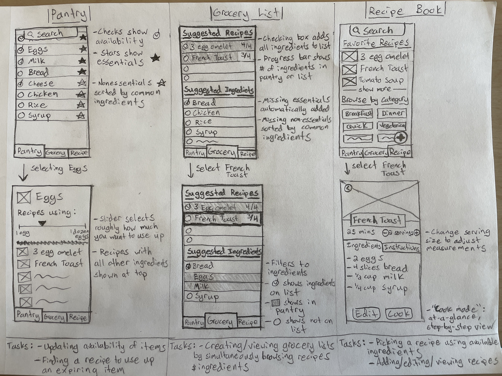
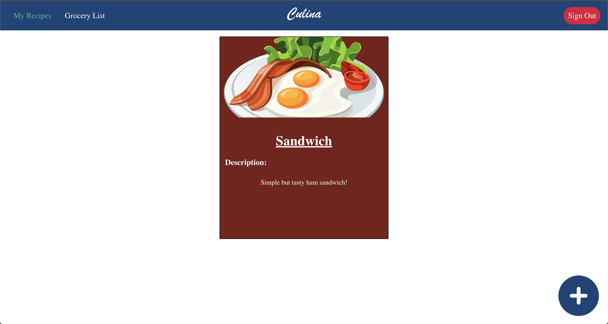
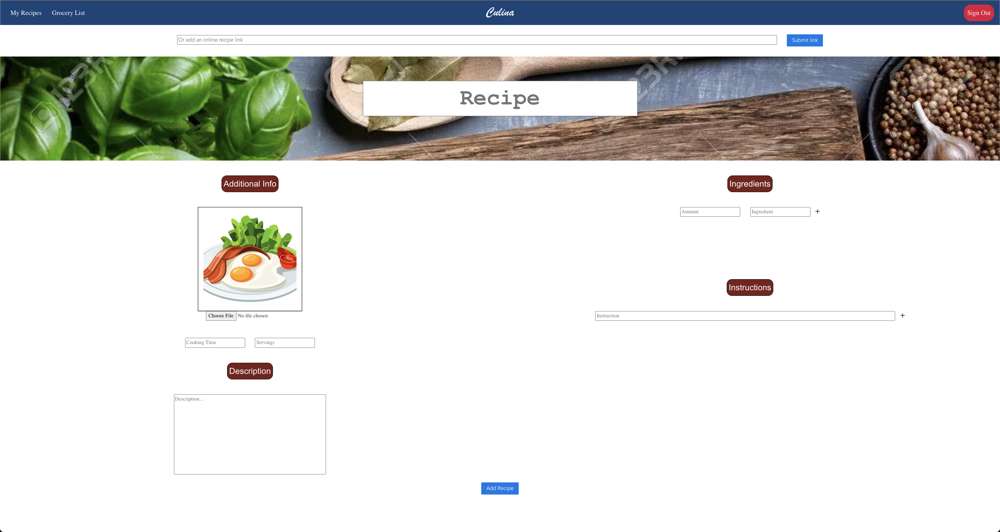
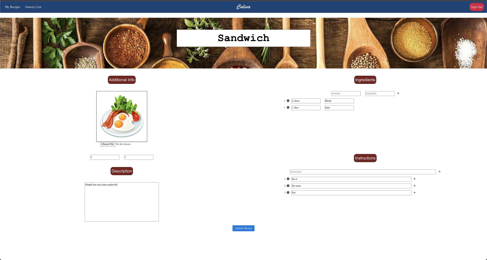
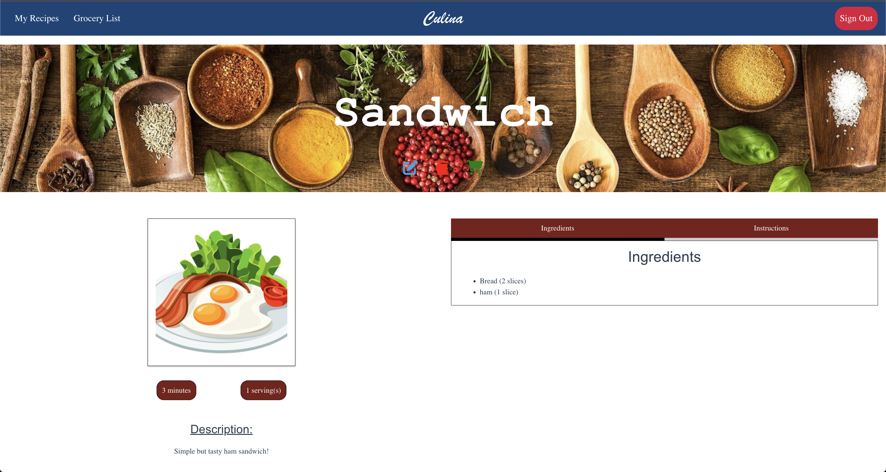
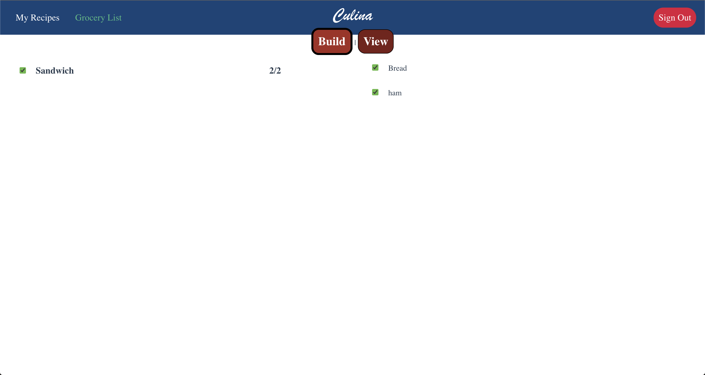

## App Info:

* App Name: Culina
* App Link: <https://recipe-tracker-53956.web.app/>

### Members

* Peng Mong Thao, thao0577@umn.edu
* Matthew Hiller, hille325@umn.edu
* Carlos Schmidt, schm4661@umn.edu
* Minh Tran, tran0842@umn.edu

## Key Features

**Describe the most challenging features you implemented
(one sentence per bullet, maximum 4 bullets):**

* the grocery list builder required a two-way link between all recipes and the ingredients on them, which was quite difficult to set up and maintain, especially with all the edge cases of the various ways to update and delete ingredients from a recipe
* the app allows the users to select and seperate the quantifiers and the ingredients by selectively highlight the latter when importing an online recipe

Which (if any) device integration(s) does your app support?

* A device integration that our app supports is uploading an image from users device or using the camera on the users device to upload an image.

Which (if any) progressive web app feature(s) does your app support?

* N/A

## Mockup images

**[Add images/photos that show your mockup](https://stackoverflow.com/questions/10189356/how-to-add-screenshot-to-readmes-in-github-repository) along with a very brief caption:**

## Testing Notes

* Amount of free api requests is limited (we have used around 25 out of 100 free requests)

* Capturing an image on an IPhone only works on Safari.

## Screenshots of Site (complete)

**[Add a screenshot of each key page](https://stackoverflow.com/questions/10189356/how-to-add-screenshot-to-readmes-in-github-repository)
along with a very brief caption:**

The homepage of our app where user can login or be redirected to the "My Recipes" page

The page that displays all the recipes the user has saved into the app 

The page where a user can add a new recipe (zoomed out)

The page where a user can edit a recipe, very similar to adding a recipe (zoomed out)

The page that appears when a new recipe is added and when the user clicks on an individual recipe on the My Recipes page

The grocery list page where the user can select items to add to their grocery list and then also view what they have in their list by toggling between the build and view tabs. 

## External Dependencies

* Library or service name: description of use
* axios: to make http requests to api
* vue-axios: to make it easier to use axious with vue
* iso8601-duration: to convert iso8601 time format
* fortawesome: to display icons such as trash can (delete), pencil (edit), shooping cart, and etc.
* MyCookBook.io: an api for getting a json object representation of an online recuoe
* uuid: for creating unique ID's. 

**Extra Notes:**

- The burger menu css in the nav bar was referenced from the web (https://www.w3schools.com/howto/howto_js_mobile_navbar.asp)

